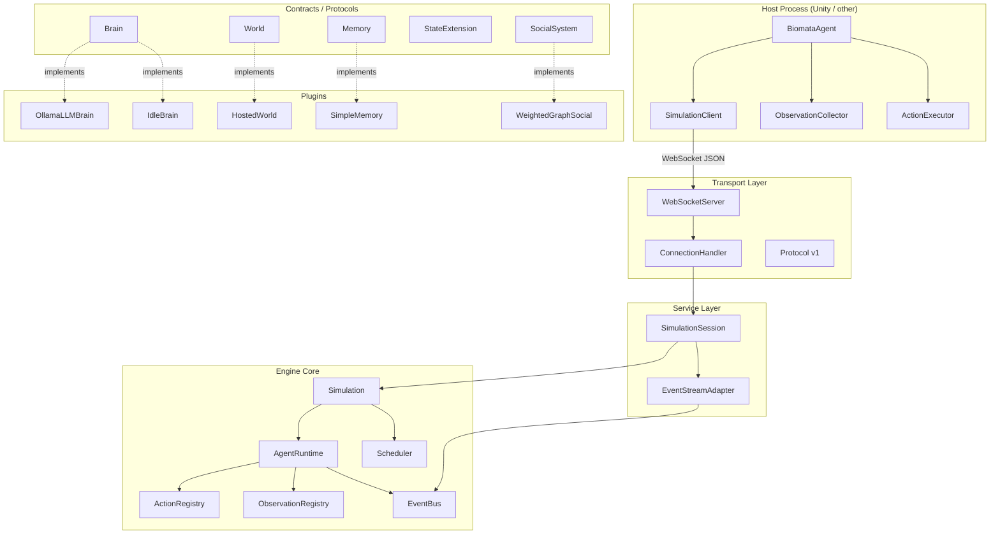
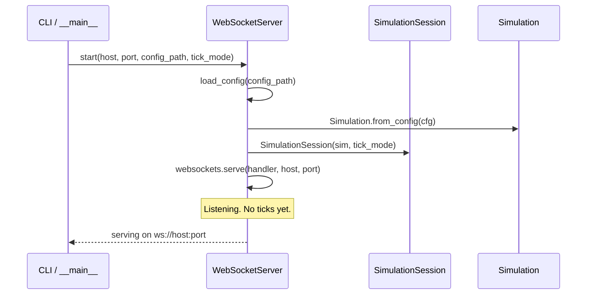
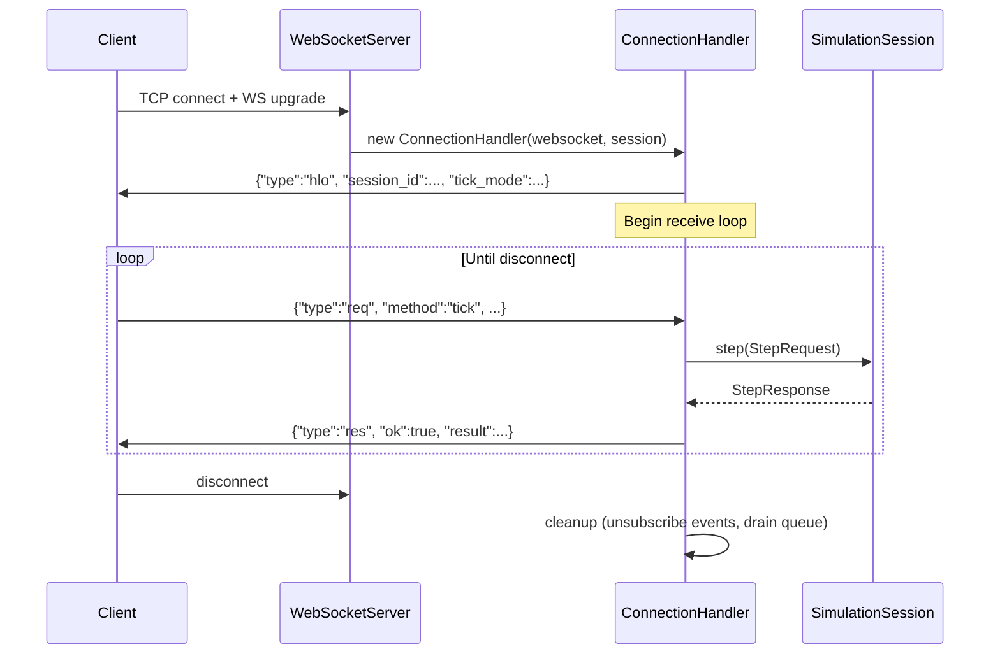
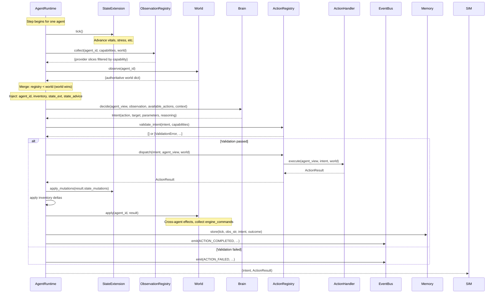
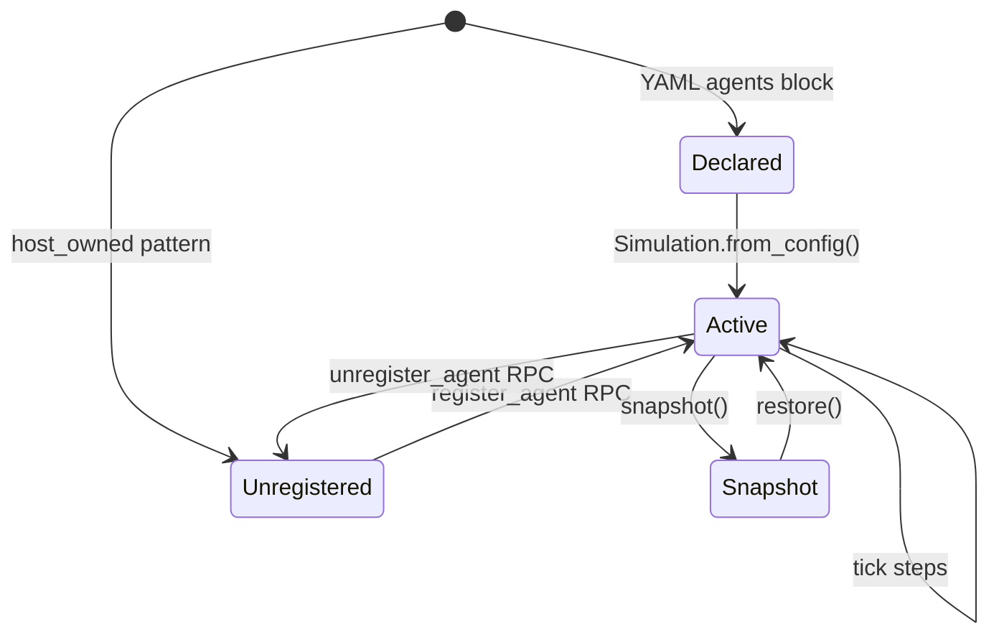
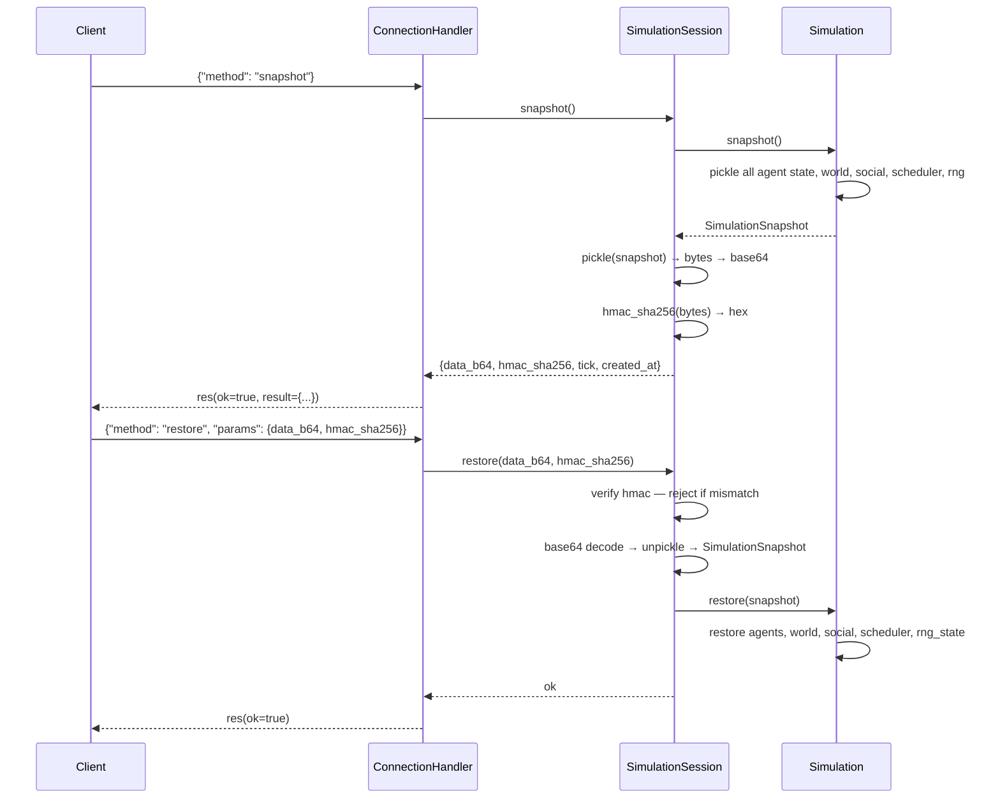
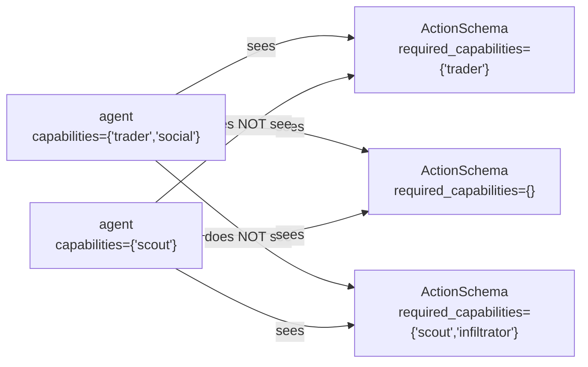

# Biomata Engine — Architecture Reference

> **Audience:** New contributors, integration engineers, and anyone debugging a live simulation.  
> **Scope:** Operational architecture — how the system actually runs, not what it aspires to be.  
> **Version:** Reflects codebase as of commit `ca684cb`.

---

## Table of Contents

1. [System Purpose](#1-system-purpose)
2. [Subsystem Map](#2-subsystem-map)
3. [Ownership Boundaries](#3-ownership-boundaries)
4. [Runtime Lifecycle](#4-runtime-lifecycle)
5. [Tick Execution Sequence](#5-tick-execution-sequence)
6. [Event Flow](#6-event-flow)
7. [Message Protocol (Wire Format)](#7-message-protocol-wire-format)
8. [Source of Truth Matrix](#8-source-of-truth-matrix)
9. [Extension Points](#9-extension-points)
10. [Agent Registration Lifecycle](#10-agent-registration-lifecycle)
11. [Snapshot / Restore Protocol](#11-snapshot--restore-protocol)
12. [Capability Tag System](#12-capability-tag-system)
13. [Configuration Patterns](#13-configuration-patterns)
14. [Common Misconceptions](#14-common-misconceptions)
15. [Known Design Debt](#15-known-design-debt)
16. [Failure Modes](#16-failure-modes)
17. [What Is Architecture vs. Implementation Detail](#17-what-is-architecture-vs-implementation-detail)
18. [Unnecessary or Over-Engineered Abstractions](#18-unnecessary-or-over-engineered-abstractions)
19. [Glossary](#19-glossary)

---

## 1. System Purpose

Biomata Engine is a **Python runtime for autonomous NPC agents** in a simulated world. Its central job is: given what an agent can perceive, ask a brain (LLM, rule-based, RL) what the agent wants to do, then execute that intent against a world and report what happened.

Three concerns are deliberately separated:

| Concern | Who owns it | What changes here |
|---|---|---|
| **World state** | `World` implementation | Spatial layout, physics, object positions |
| **Cognition** | `Brain` implementation | Decision logic — LLM prompts, policies, rules |
| **Actions** | `ActionHandler` implementations | What "move north" actually does to state |

Everything else — scheduling, observation assembly, event routing, protocol encoding, Unity wiring — is infrastructure that makes those three concerns work together at runtime.

The engine is **not a game engine**. It does not own the render loop, physics, or animation. When Unity is involved, Unity is authoritative on presentation; the engine is authoritative on agent decisions and their logical outcomes.

---

## 2. Subsystem Map



**Dependency direction**: Engine core has zero imports from service, transport, or plugins. Contracts define protocols; plugins implement them. Transport depends on service; service depends on engine.

---

## 3. Ownership Boundaries

This is the most important thing to understand before touching the code. Violations of these boundaries are where bugs hide.

### Who owns what state

| State | Owner | Non-owner access |
|---|---|---|
| Agent identity (`id`, `name`, `capabilities`) | `Agent` object in `Simulation._agents` | Read-only via `AgentView` |
| Agent inventory | `Agent.inventory` dict | `AgentRuntime` applies deltas; World reads via `AgentView` |
| Agent memory | `Memory` impl (e.g. `SimpleMemory`) | `AgentRuntime` calls `.store()` / `.recall()` only |
| Agent vitals / stress | `StateExtension` impl | `AgentRuntime` calls `.tick()` / `.apply_mutations()` only |
| World spatial state | `World` impl | Engine reads via `world.observe()` / capability protocols |
| Social graph | `SocialSystem` impl | Written by `SocialEffectSubscriber` from events; read in brain prompts |
| Tick number | `World.current_tick` (authoritative) | `Simulation` mirrors for convenience |
| Engine commands queue | `HostedWorld._pending_commands` | Drained by `ConnectionHandler` per tick |

### Who owns what lifecycle

| Component | Lifecycle owner |
|---|---|
| `Simulation` | Caller (`SimulationSession` or script) |
| `SimulationSession` | `ConnectionHandler` (one session per connection) |
| `Agent` objects | `Simulation._agents` dict; mutated by `register_agent` / `unregister_agent` |
| WebSocket connection | `WebSocketServer` (creates `ConnectionHandler` per connect) |
| Async tick loop (AUTONOMOUS) | `SimulationSession.run()` task |
| Unity `BiomataAgent` | Unity scene lifecycle (`Awake` / `OnDestroy`) |

### The `AgentView` contract

`AgentRuntime` **never passes a mutable `Agent` to a brain, handler, or world**. It always wraps in `AgentView` — a frozen snapshot of identity + inventory at the moment of step start. This is the read-only surface brains and handlers see. If a handler wants to change inventory, it must return `ActionResult` with `state_mutations`; the runtime applies those mutations after the handler returns.

Violation pattern to avoid: storing a reference to `AgentView` across ticks. It is intentionally ephemeral.

---

## 4. Runtime Lifecycle

### Server startup (WebSocket mode)



**Important**: `Simulation.from_config()` runs all constructors (World, Agents, Brain instances, etc.). If a brain's `__init__` fails (e.g., bad Ollama endpoint) the server does not start. There is no lazy initialization.

### Connection lifecycle



### Session tick modes

**HOST_DRIVEN** (default):
- The client controls when ticks fire
- `tick` requests are synchronous RPC: one request in, one `StepResponse` out
- Ticks only happen when the client asks
- Unity drives this from its `Update` loop or a coroutine

**AUTONOMOUS**:
- `SimulationSession.run()` is spawned as an asyncio task on session creation
- It loops `sim.run_tick()` for `config.engine.ticks` iterations
- Client can `pause` / `resume`, subscribe to events, push observations
- Client is a spectator / controller, not a tick driver
- `paused` is an `asyncio.Event` — the loop does `await self._paused.wait()` each tick

**Critical**: In AUTONOMOUS mode, calling `tick` via RPC is still valid, but it steps once and returns. The running loop and RPC ticks share the same `Simulation` object with no locking. Do not mix modes.

---

## 5. Tick Execution Sequence

This is the hot path. Understanding this in detail is essential for any performance work or behavioral debugging.



### Observation merge order (last write wins)

1. ObservationRegistry providers (lowest priority — user-defined, capability-filtered)
2. `world.observe(agent_id)` (overwrites provider output for same keys)
3. Engine-injected fields: `agent_id`, `agent_name`, `inventory`, `state_ext`, `state_advice`, `state_str` (highest priority — always overwrite)

This means: a provider that tries to put its own value under `agent_id` will always be clobbered. This is intentional.

### Scheduler behavior

`SimultaneousScheduler` (default): all agents' `brain.decide()` calls are dispatched concurrently via `asyncio.gather`. Action results are applied sequentially in arrival order. Because `brain.decide()` is async (network I/O for Ollama), concurrent scheduling significantly improves throughput.

`SequentialScheduler`: agents step one at a time in configured order. Used when strict determinism matters (e.g., replay validation, research reproducibility). Order is defined in `sim.yaml` under `scheduler_order`.

**Note**: Concurrent scheduling means agent A's action is applied before agent B's brain has made its decision, but agent B observed the world before agent A acted. This is a known intra-tick snapshot vs. application ordering issue — not a bug, a tradeoff.

---

## 6. Event Flow

### EventBus topology

```mermaid
graph LR
    AR[AgentRuntime] -->|emit| EB[EventBus]
    SIM[Simulation] -->|emit| EB

    EB -->|subscribe| SES[SocialEffectSubscriber]
    EB -->|subscribe| ELS[EventLogSubscriber]
    EB -->|subscribe| OBS[ObservabilitySubscriber]
    EB -->|subscribe| ESA[EventStreamAdapter]

    ESA -->|ServiceEvent| CH[ConnectionHandler]
    CH -->|{"type":"evt",...}| WSClient[WebSocket Client]
```

### Event types and their sources

| Event type | Emitted by | Payload |
|---|---|---|
| `TICK_START` | `Simulation.run_tick()` | tick, agent_count |
| `TICK_END` | `Simulation.run_tick()` | tick, decisions, errors |
| `ACTION_COMPLETED` | `AgentRuntime.step()` | agent_id, action, outcome, side_effects |
| `ACTION_FAILED` | `AgentRuntime.step()` | agent_id, action, error_message |
| `BRAIN_DECIDED` | `AgentRuntime.step()` (optional) | agent_id, intent, prompt (if enabled) |
| `AGENT_REGISTERED` | `Simulation.register_agent()` | agent_id, name |
| `AGENT_UNREGISTERED` | `Simulation.unregister_agent()` | agent_id |

### SocialEffectSubscriber behavior

When `ACTION_COMPLETED` fires, the subscriber inspects `event.data["side_effects"]` for entries of `type == "social"`. For each, it calls `social_system.update(from_id, to_id, delta)`. This is the **only** mechanism for updating the social graph during simulation. Handlers must emit `side_effects` in their `ActionResult` — the engine does not infer social effects from actions.

### EventStreamAdapter and backpressure

Each `ConnectionHandler` gets an `asyncio.Queue` for event delivery. `EventStreamAdapter` puts events onto this queue. If the queue is full (client not consuming fast enough), the event is **dropped with a warning log** — not buffered, not retried. The queue size is bounded to prevent unbounded memory growth during slow connections.

This means: if you're building tooling that counts events for analytics, use in-process subscribers, not the WebSocket event stream.

---

## 7. Message Protocol (Wire Format)

All messages are JSON. No binary encoding. No streaming (each message is a complete JSON object terminated by newline).

### Frame envelope

Every frame has:
- `type`: `"hlo"`, `"req"`, `"res"`, `"evt"`
- `v`: protocol version (currently `1`)

### Hello (server → client, once on connect)

```json
{
  "type": "hlo",
  "v": 1,
  "server": "biomata-engine",
  "server_version": "0.5.0",
  "session_id": "<uuid>",
  "tick_mode": "host_driven",
  "capabilities": ["snapshot", "events", "agent_registration"]
}
```

The `session_id` in hello is stable for the connection lifetime. It appears on all events.

### Request (client → server)

```json
{
  "type": "req",
  "v": 1,
  "id": "<uuid>",
  "method": "tick",
  "params": { ... }
}
```

All requests are fire-and-wait: the client sends one request, waits for the `res` with the same `id`. Pipelining (sending a second `req` before getting the first `res`) is not specified and behavior is undefined.

### Response (server → client)

```json
{
  "type": "res",
  "v": 1,
  "id": "<uuid>",
  "ok": true,
  "result": { ... }
}
```

or on error:

```json
{
  "type": "res",
  "v": 1,
  "id": "<uuid>",
  "ok": false,
  "error": {
    "code": -32601,
    "name": "METHOD_NOT_FOUND",
    "message": "unknown method 'foo'"
  }
}
```

### Error code space

| Range | Domain |
|---|---|
| `-32xxx` | Transport / framing (invalid JSON, unknown method, parse error) |
| `-1` to `-99` | Domain errors (snapshot mismatch, agent not found, etc.) |

### Event (server → client, unsolicited)

```json
{
  "type": "evt",
  "v": 1,
  "session_id": "<uuid>",
  "seq": 42,
  "event_type": "action_completed",
  "tick": 5,
  "agent_id": "agent_001",
  "ts": "2026-05-23T14:32:01.123Z",
  "data": { ... }
}
```

`seq` is a per-connection monotonic counter starting at 0. Use it to detect dropped events. There is no gap-fill mechanism — if you detect a gap, you missed events.

### Method reference

| Method | Direction | Tick mode |
|---|---|---|
| `tick` | client→server | HOST_DRIVEN |
| `pause` | client→server | AUTONOMOUS |
| `resume` | client→server | AUTONOMOUS |
| `register_agent` | client→server | both |
| `agent.register` | client→server | both (v2 dot notation) |
| `remove_agent` | client→server | both |
| `agent.unregister` | client→server | both (v2 dot notation) |
| `agent.list` | client→server | both |
| `send_observation` | client→server | AUTONOMOUS |
| `snapshot` | client→server | both |
| `restore` | client→server | both |
| `subscribe_events` | client→server | both |

`register_agent` and `agent.register` are two wire representations of the same operation. `agent.register` uses a nested `brain: {class, config}` shape. Both are fully supported and produce identical runtime behavior.

---

## 8. Source of Truth Matrix

| Question | Where to look | Notes |
|---|---|---|
| What tick is the simulation on? | `world.current_tick` | `Simulation._tick` mirrors this but `World` owns it |
| What agents exist? | `Simulation._agents` dict | Keyed by agent_id string |
| What can agent X do? | `ActionRegistry` filtered by `agent.capabilities` | Schemas returned to brain via `context.available_actions` |
| What is agent X perceiving? | Built fresh each tick in `AgentRuntime._build_observation()` | Not stored; ephemeral |
| What did agent X do last tick? | `agent.memory.recall()` or EventBus `ACTION_COMPLETED` log | Memory is lossy (rolling window) |
| What engine_commands does Unity execute? | `HostedWorld._pending_commands` | Drained by `ConnectionHandler` after each tick response |
| What is the relationship between A and B? | `SocialSystem.relationship(a, b)` | Float weight, directed |
| What YAML defined this simulation? | `Simulation._config` (`EngineConfig`) | Config snapshot captured at construction time |

---

## 9. Extension Points

These are the only interfaces intended for external implementation. Everything else is internal.

### Brain Protocol (`src/contracts/brain.py`)

```python
class Brain(Protocol):
    async def decide(
        self,
        agent: AgentView,
        observation: Observation,
        actions: list[ActionSchema],
        context: BrainContext,
    ) -> Intent: ...
```

Implement this to add: GPT-4, Claude, local RL policy, behavior tree, scripted sequence, etc.

**Gotchas:**
- `decide()` must be `async`. Synchronous brains must `return` directly (no `await` needed, but the `async def` signature is required).
- `BrainContext` gives you `tick`, `memories` (formatted string), `metadata` (world-injected), `agent_metadata`.
- You do not get mutable state. Do not store references to `agent` or `observation` past the call.

### World Protocol (`src/contracts/world.py`)

The base `World` protocol requires: `observe()`, `apply()`, `tick()`, `current_tick`, `metadata`.

Optional capability protocols are structural (duck-typed, no inheritance required):
- `SpatialWorld` — implement `are_adjacent(a, b)` to enable spatial action schemas
- `VisibilityWorld` — implement `get_nearby_agents(agent_id)` to populate `nearby_agents` in observations automatically
- `PlaceableWorld` — implement `place_agent(agent_id, **kwargs)` to accept placement from config loader
- `ExternalWorld` — implement `push_observation()`, `push_metadata()`, `collect_commands()` to use HostedWorld pattern

The engine checks capability via `isinstance(world, SpatialWorld)` — but since these are `Protocol` classes, this works via structural subtyping. You don't inherit; you just implement the method signatures.

### ActionHandler

```python
class ActionHandler(Protocol):
    @property
    def schema(self) -> ActionSchema: ...

    async def execute(
        self,
        agent: AgentView,
        intent: Intent,
        world: World,
    ) -> ActionResult: ...
```

Implement to add new actions. Register with `ActionRegistry.register(handler)`.

`ActionResult` fields:
- `success: bool`
- `outcome_text: str` — goes into memory and brain prompt next tick
- `state_mutations: dict` — applied by engine after handler returns; supports `inventory` sub-dict and keys for `StateExtension`
- `commands: list[dict]` — engine_commands relayed to Unity / host
- `side_effects: list[dict]` — consumed by `SocialEffectSubscriber`; format: `{"type": "social", "from": id, "to": id, "delta": float}`

### ObservationProvider (`src/contracts/observation.py`)

```python
class ObservationProvider(Protocol):
    @property
    def schema(self) -> ObservationSchema: ...

    def collect(
        self,
        agent_id: str,
        capabilities: frozenset[str],
        world: World,
    ) -> dict: ...
```

Returns a dict slice merged into the agent's observation each tick. Register with `ObservationRegistry.register(provider)`.

### Memory Protocol (`src/contracts/memory.py`)

```python
class Memory(Protocol):
    def store(self, tick: int, observation: str, intent: Intent, outcome: str) -> None: ...
    def recall(self, n: int = 6) -> str: ...
    def serialize(self) -> bytes: ...
    def restore(self, data: bytes) -> None: ...
```

Implement for: vector store recall, episodic memory, hierarchical summaries, external database.

### StateExtension Protocol (`src/contracts/state.py`)

Per-agent simulation-specific state (vitals, stress, pheromone levels, etc.). Called every tick via `tick()` and after action resolution via `apply_mutations()`. Returns `urgent_advice()` injected into the brain prompt under `state_advice`.

### SocialSystem Protocol (`src/contracts/social.py`)

Implement for alternative relationship representations (e.g., faction membership, trust networks, graph databases).

### Plugin registration (YAML)

Any protocol implementation can be registered via YAML `class: dotted.module.ClassName`. The config loader dynamically imports and instantiates. Constructor kwargs in YAML are passed as `**config` to `__init__`. Factory functions (returning an instance) are also supported — the loader detects via `callable` inspection.

---

## 10. Agent Registration Lifecycle



### YAML-declared agents (engine-owned)

Agents in the `agents:` block of `sim.yaml` are instantiated during `Simulation.from_config()`. They exist before any client connects. If a client connects after tick 3, those agents have already acted 3 times.

### Runtime-registered agents (host-owned)

Clients call `register_agent` RPC. The engine:
1. Validates the `AgentDefinition` (schema check)
2. Dynamically imports and instantiates `brain`, `memory`, `state_ext`
3. Calls `world.place_agent(agent_id, **position)` if world implements `PlaceableWorld`
4. Adds to `Simulation._agents`
5. Emits `AGENT_REGISTERED` event

The agent participates in the **next** tick after registration, not the current one. If a tick is in progress when `register_agent` arrives, the new agent is queued; the scheduler will include it in the subsequent tick.

### Unregistration

`unregister_agent` removes the agent from `Simulation._agents` and emits `AGENT_UNREGISTERED`. The agent's brain, memory, and state objects are garbage-collected when the dict entry drops. There is no cleanup hook on `Brain` or `Memory` — if your brain holds external resources (e.g., a session with a remote model), you must manage that yourself.

### Unity ownership modes

`BiomataAgent.OwnershipMode` in the Unity SDK controls which pattern is used:

| Mode | Unity behavior | Backend expectation |
|---|---|---|
| `BindToExisting` | No registration RPC sent; Unity attaches visual shell to pre-existing agent | Agent declared in YAML |
| `CreateAtRuntime` | `RegisterAsync` called in `Start()`; `UnregisterAsync` called in `OnDestroy()` | No YAML entry; backend starts empty |

The two modes are **mutually exclusive per-agent**. A single simulation can mix both — some agents declared in YAML, others spawned at runtime.

---

## 11. Snapshot / Restore Protocol

Snapshots are **in-process only**. They use Python `pickle`, which means:
- Snapshots are not portable between Python versions
- Snapshots are not portable between different plugin class paths
- Snapshots are not safe to accept from untrusted clients

The server generates an ephemeral HMAC-SHA256 key per process. Snapshot data is signed. On restore, the signature is verified. This prevents tampering but does **not** solve the class-path portability problem — a snapshot taken with `MyBrain` loaded will fail to restore if `MyBrain` is renamed or moved.



### What is captured

- RNG state (`random.Random.getstate()`) — determinism guarantee
- Engine config snapshot
- All agent state: id, name, inventory, `memory.serialize()`, `state_ext.serialize()`, `brain.serialize()` (if implemented)
- `social.serialize()` (if social system implements `Snapshotable`)
- `world.serialize()` (if world implements `Snapshotable`)
- `scheduler.serialize()` (if scheduler implements `Snapshotable`)

### What is NOT captured

- Pending engine_commands in `HostedWorld._pending_commands` (drained before snapshot would be useful anyway)
- In-flight async brain calls
- Active WebSocket connections
- EventBus subscriber registrations

---

## 12. Capability Tag System

Capabilities are `frozenset[str]` on each `Agent`. They serve as a visibility gate on both actions and observations.

**Rule**: an agent sees an action or observation schema if and only if `agent.capabilities ∩ schema.required_capabilities ≠ ∅`, **or** `schema.required_capabilities == frozenset()` (universal).

> **Rename note:** `ActionSchema.tags` has been renamed to `ActionSchema.required_capabilities`. The `tags` field is kept as a backwards-compatible alias. See [`docs/architecture/action_manifest.md`](architecture/action_manifest.md).



This affects two things:
1. The `available_actions` list passed to `brain.decide()` — the brain is only offered actions it can legally take
2. The observation providers collected by `ObservationRegistry` — capability-tagged providers only run for qualifying agents

Capabilities are **not** enforced as a security boundary. The engine does not prevent a misconfigured agent from executing an action it "shouldn't" have — the capability system is a filter for what the brain is shown, not an access control list. A brain that somehow constructs an `Intent` for a gated action will fail at `validate_intent()` because the action won't be found in the agent's visible schema set.

---

## 13. Configuration Patterns

### Pattern A: Engine-owned agents, hosted world

The backend declares agents and delegates world authority to Unity.

```yaml
engine:
  ticks: 0     # 0 = run forever in AUTONOMOUS mode
  seed: 42

world:
  class: src.plugins.external.world.HostedWorld

agents:
  - id: guard_01
    name: Guard
    brain:
      class: src.plugins.builtin.ollama.brain.OllamaLLMBrain
      model: llama3
```

Unity uses `BiomataAgent` with `BindToExisting` on a prefab whose `agentId` matches `guard_01`. Unity pushes observations each frame; backend pushes decisions as events.

### Pattern B: Host-owned agents, hosted world

Unity owns agent lifecycle. Backend starts empty.

```yaml
world:
  class: src.plugins.external.world.HostedWorld
registry:
  class: myproject.registry.build_registry
# No agents block
```

Unity instantiates prefabs, calls `RegisterAsync` for each, and `UnregisterAsync` on destroy.

### Pattern C: Fully local simulation (no Unity)

Python controls everything. Use for headless research, batch experiments.

```yaml
engine:
  ticks: 500
  seed: 1337
  scheduler: sequential

world:
  class: myproject.world.GridWorld
  width: 20
  height: 20

agents:
  - id: explorer
    brain:
      class: src.plugins.builtin.ollama.brain.OllamaLLMBrain
```

Run with `python -m src.cli.main run sim.yaml`.

### Dynamic import convention

Any `class:` value is a fully-qualified dotted Python path. The config loader calls `importlib.import_module` on everything left of the last dot, then `getattr` for the class name. This means:
- Classes must be importable from the Python path at server startup
- `sys.path` must include your project root
- There is no sandboxing — loaded classes run in the server process with full permissions

---

## 14. Common Misconceptions

### "The engine controls the world clock"

The engine does not. `World.current_tick` is the authoritative tick counter and it lives in the `World` implementation. `Simulation` calls `world.tick()` and then reads back `world.current_tick`. If your `World` implementation ignores `tick()`, the tick counter won't advance and the engine will emit events with `tick=0` forever.

### "Autonomous mode means the engine runs independently of Unity"

Not quite. In AUTONOMOUS mode, the backend drives ticks internally — but if you're using `HostedWorld`, each tick's `world.observe()` returns whatever was last pushed via `push_observation()`. If Unity isn't pushing observations, agents see stale data from the previous connection, or empty observations if they never connected.

### "engine_commands are processed immediately"

Engine commands (`ActionResult.commands`) are queued in `HostedWorld._pending_commands` and returned in the `StepResponse`. They are not "executed" in any sense by the backend. Unity (or whatever host) receives them in the tick response and decides what to do. The backend has no feedback loop — it doesn't know if Unity executed `navigate north` or ignored it.

### "Registered agents are active immediately"

An agent registered via `register_agent` RPC is not included in the tick that's currently in progress. It participates starting from the next tick. There is no queueing mechanism within a tick.

### "Snapshots are portable"

Snapshots use pickle and are signed with an ephemeral per-process key. They cannot be loaded by a different process or a different run of the same process. They are only useful within the same running server process (e.g., save state at tick 50, run 10 more ticks, restore to tick 50).

### "Capability tags are access control"

They are a brain-visibility filter. An action tagged `{"merchant"}` won't appear in a non-merchant agent's available actions list. But if a brain somehow produces an `Intent` for that action anyway (e.g., replay brain, malformed), `validate_intent()` rejects it because the action isn't in the agent's action set. This is still just input validation, not a security enforcement mechanism.

### "The social graph is updated by the SocialSystem.update() call in handlers"

It is not. Handlers return `side_effects` in `ActionResult`. The engine never calls `social.update()` directly — this is done by `SocialEffectSubscriber`, which listens on `ACTION_COMPLETED` events. If you call `social.update()` directly in a handler, it works, but it bypasses the event audit trail and the indirection architecture.

### "AUTONOMOUS and HOST_DRIVEN are just about who calls tick"

There's an additional behavioral difference: in HOST_DRIVEN, `StepRequest.agent_observations` is the mechanism for pushing observation data into `HostedWorld`. In AUTONOMOUS mode, you use the `send_observation` RPC. They go to the same place (`world.push_observation()`), but you need to use the right mechanism for the mode.

---

## 15. Known Design Debt

### Pickle-based snapshots

The snapshot format (`SimulationSnapshot`) uses Python pickle. This makes snapshots:
- Not cross-process portable (different server run = different HMAC key = reject)
- Not version-stable (rename a class, old snapshots break)
- Not inspectable without loading them

A JSON-based or msgpack-based format with explicit version field would resolve all three. The `serialize()` / `restore()` protocol on each component already provides the right interface — the outer `SimulationSnapshot` container just needs to switch serialization format.

### No `Brain.cleanup()` hook

When an agent is unregistered, its `Brain` instance is garbage-collected. If a brain holds external resources (persistent HTTP session, thread pool, file handle), there is no callback to release them. This is a resource leak waiting to happen as soon as anyone writes a brain that holds state.

### Simultaneous scheduler and action ordering

With `SimultaneousScheduler`, all brains run concurrently (correct — they observe the same world), but action results are applied in `asyncio.gather` completion order. This means the "simultaneous" label is not quite accurate: agent A's observation mutations are visible to agent B if B's apply happens after A's. For most simulations this doesn't matter. For strict simultaneous-semantics research, use `SequentialScheduler`.

### No request pipelining in the protocol

The wire protocol has no specification for what happens if a client sends a second `req` before the first `res` arrives. The `ConnectionHandler` processes one message at a time via a receive loop; a second request during a long `tick` would queue on the TCP receive buffer and be processed after the response is sent. This is not documented and callers should not rely on it.

### `agent.register` / `register_agent` dual-format

There are two wire formats for the same operation — flat params (`register_agent`) and nested dot-notation (`agent.register`). Both are handled in `ConnectionHandler`. This is a versioning artifact that adds handler dispatch complexity for no runtime benefit. The flat-params form should be deprecated.

### YAML `class:` is a dynamic import with no sandboxing

Any class path in a YAML config file is executed in the server process. There is no vetting, no allowlist, no subprocess isolation. This is acceptable for trusted configs but would be a significant attack surface if configs come from untrusted sources.

### `HostedWorld._pending_commands` is a list with no size bound

If Unity is slow to consume tick responses (or disconnects mid-simulation), `_pending_commands` will accumulate without bound. For long simulations with many commands per tick and a slow or absent client, this is a memory leak.

---

## 16. Failure Modes

### Brain timeout / Ollama unavailable

`OllamaLLMBrain.decide()` makes an HTTP call. If Ollama is unavailable or slow, the call hangs. The current code has a shared semaphore to bound concurrent calls, but no per-call timeout. If Ollama hangs indefinitely, all agents block forever on that tick.

**Mitigation**: Add `asyncio.wait_for(brain.decide(...), timeout=N)` in `AgentRuntime.step()`. Currently not present.

### JSON parse failure in brain response

If the LLM returns malformed JSON, `OllamaLLMBrain` falls back to keyword extraction and then to a configurable `default_action`. The fallback is logged but not surfaced to the caller as an error. From the engine's perspective, the agent successfully decided `idle`. This can make it hard to detect prompt engineering regressions.

### Schema validation mismatch

If an `ActionSchema` requires parameter `"target"` and the brain returns an intent without it, `validate_intent()` returns errors and the action fails. The agent gets `ACTION_FAILED` event. Memory records the failure as the outcome. On the next tick, the brain sees the failure in its context and (hopefully) corrects. If the schema and brain prompt are misaligned, the agent can loop in failure permanently.

### Snapshot HMAC mismatch

The server generates a new HMAC key on every process start. If you snapshot, restart the server, and try to restore, the HMAC check fails with error code `-32`. There is no key persistence mechanism. Snapshots do not survive server restarts.

### `register_agent` with unknown class path

If the `brain.class` dotted path in a runtime registration is wrong (typo, missing module), `importlib.import_module` raises `ImportError`. The current handler catches generic exceptions and returns an error response. The error message includes the exception text, which may expose internal paths to the client.

### EventBus subscriber exception

`EventBus.emit()` calls subscribers synchronously. If a subscriber raises an unhandled exception, it propagates up through `emit()` and into `AgentRuntime.step()`, potentially aborting the tick. Subscribers should never raise; the `ObservabilitySubscriber` wraps user-provided hooks in try/except, but built-in subscribers (`SocialEffectSubscriber`, `EventLogSubscriber`) do not.

### Memory buffer overflow

`SimpleMemory` uses a bounded deque (`capacity` default 20). Overflow is silent — oldest entries are discarded. Agents in long simulations effectively have no memory of the distant past. This is by design, but callers who expect full history accumulation will be surprised.

---

## 17. What Is Architecture vs. Implementation Detail

### Architecture (the system cannot change without these)

- **Protocol separation** (Brain / World / ActionHandler as distinct protocols): removing this would collapse the extension model
- **AgentView immutability**: handlers and brains cannot mutate agent state directly; this invariant prevents order-of-execution bugs in the scheduler
- **EventBus as the only side-channel**: all cross-cutting effects (social, logging, streaming) go through events, not direct coupling
- **Tick as the unit of computation**: one world step, one decision per agent, one result per agent — this is the atomic unit
- **`state_mutations` applied by the runtime, not the handler**: handlers declare what they want to change; the engine applies it. This makes mutation auditable and snapshotable.

### Implementation detail (can change without breaking contracts)

- Pickle as the snapshot serialization format
- `asyncio.Queue` for WebSocket event backpressure
- HMAC-SHA256 for snapshot signing
- Flat vs. dot-notation agent registration wire format
- `SimpleMemory` as a deque — any rolling buffer works
- `WeightedGraphSocial` using a NetworkX-like dict-of-dicts — any directed weighted graph works
- Ollama as the LLM backend — only `decide()` signature matters
- YAML as the config format — the `SimConfig` Pydantic model is the real interface

---

## 18. Unnecessary or Over-Engineered Abstractions

### `SimulationController` protocol in `src/service/interfaces.py`

This protocol has exactly one implementation: `SimulationSession`. It defines the same method signatures as `SimulationSession` with no additions. It exists to allow the `ConnectionHandler` to depend on the protocol rather than the concrete class — a valid architectural principle — but the protocol itself has never had more than one implementation, and the concrete class is in the same package. The indirection adds a file to navigate without providing real decoupling. Worth keeping only if a second session type is planned.

### `EventStreamAdapter` as a separate class

The adapter bridges `EventBus` → `ServiceEvent` handler callbacks. It is a translation layer between two internal event systems in the same process. The translation is: wrap an `EngineEvent` in a `ServiceEvent` (adds `session_id`). One method, five lines. The abstraction boundary is real (service layer should not import engine internals directly), but the class could be inlined into `SimulationSession`.

### Dual agent registration wire formats

Having both `register_agent` (flat params) and `agent.register` (nested dot-notation) in the protocol adds a dispatch branch in `ConnectionHandler` and requires maintaining two code paths that do the same thing. One format should be canonical; the other deprecated.

### `PlaceableWorld` as a separate protocol

`PlaceableWorld.place_agent()` is called exactly once in the codebase: in `Simulation.register_agent()`, during runtime agent registration. It's not called during YAML-declared agent construction (which goes through the config loader). The protocol adds a check (`isinstance(self.world, PlaceableWorld)`) for a method that will almost never exist on simple worlds. It could be folded into the base `World` protocol as an optional method with a default no-op.

### `ObservabilitySubscriber` wrapping user hooks

The subscriber wraps user-provided callables in try/except, logs exceptions, and continues. This is correct. But the subscriber is configured via `Simulation.on_tick()`, `Simulation.on_action()`, etc. — methods that return the simulation for chaining. This builder-pattern API is slightly over-designed for what amounts to "append to a list of callbacks."

---

## 19. Glossary

| Term | Definition |
|---|---|
| **Agent** | A named entity with a brain, memory, inventory, and capabilities that participates in simulation ticks |
| **AgentView** | An immutable snapshot of an agent's identity and inventory, valid for one step only; passed to brains and handlers |
| **ActionHandler** | Implements `execute(agent, intent, world) → ActionResult`; maps an intent to world mutations |
| **ActionRegistry** | The registry of all available action schemas and their handlers; filters by agent capabilities |
| **ActionResult** | The output of a handler: success flag, outcome text, state mutations to apply, engine commands to relay, social side effects |
| **ActionSchema** | Metadata describing an action: name, description, parameter spec, capability tags |
| **AgentDefinition** | A validated specification for creating an agent at runtime; used for both YAML and RPC registration |
| **AUTONOMOUS mode** | Session mode where the backend drives the tick loop; client subscribes to events |
| **Brain** | Implements `decide(agent_view, observation, actions, context) → Intent`; the cognitive layer |
| **BrainContext** | Read-only context passed to `Brain.decide()`: tick number, formatted memories, world metadata, agent metadata |
| **Capability** | A string tag on an agent that gates which action schemas and observation providers the agent can see |
| **ConnectionHandler** | Per-WebSocket-connection adapter; translates wire frames to/from `SimulationSession` calls |
| **engine_commands** | Opaque dicts in `ActionResult.commands` relayed to the host (Unity) for execution; the backend does not interpret them |
| **EventBus** | Synchronous pub/sub within the engine; subscribers are called in registration order during `emit()` |
| **HostedWorld** | World implementation where the host (Unity) is authoritative; backend observes what the host pushes |
| **HOST_DRIVEN mode** | Session mode where the client triggers each tick via RPC |
| **Intent** | The brain's decision: action name, optional target agent id, parameters dict, optional reasoning string |
| **Memory** | Per-agent storage of past observations and outcomes; formatted string returned to brain each tick via `recall()` |
| **ObservationProvider** | Produces a dict slice for an agent's observation each tick; registered in `ObservationRegistry` |
| **ObservationRegistry** | Manages provider registration and per-agent observation collection; filters by capability tags |
| **Scheduler** | Controls the order in which agents are stepped within a tick (`Simultaneous` or `Sequential`) |
| **ServiceEvent** | An `EngineEvent` wrapped with `session_id`; the format delivered to WebSocket event subscribers |
| **Simulation** | Top-level Python object owning agents, world, scheduler, event bus, and action/observation registries |
| **SimulationSession** | Service-layer controller wrapping `Simulation`; manages tick mode, pause/resume, event subscriptions |
| **SimulationSnapshot** | A pickle-serialized checkpoint of all simulation state at a given tick |
| **SocialSystem** | Tracks directed weighted relationships between agents; updated via `ACTION_COMPLETED` side effects |
| **StateExtension** | Per-agent simulation-specific state (vitals, stress) that ticks and accepts mutation results |
| **StepRequest** | DTO from client to server for `tick` RPC: agent observations + world metadata |
| **StepResponse** | DTO from server to client after tick: per-agent decisions (action, outcome, commands) + errors |
| **TickSummary** | Internal engine result of `run_tick()`: tick number, per-agent (intent, result) pairs, errors |
| **World** | The simulation environment; owns `observe()`, `apply()`, `tick()`, and `current_tick` |
